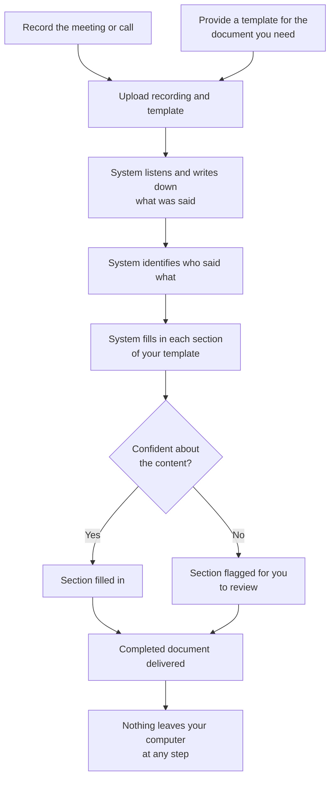

# localscribe

Fully local tool that takes a recorded meeting/call video and a template
file, transcribes the recording on-device, and fills the template's fields
from the transcript — no audio, video, or transcript data ever leaves the
machine.

Not a meeting-minutes generator. It automates the manual step of listening
to a recording and typing its content into a required document format,
for whatever template the situation calls for.

## How it works



## Status

v1 pipeline implemented (11/11 tasks complete), pending real-world integration test. See:
- [PRD](Local%20Meeting%20Summarizer%20-%20PRD.md) — requirements, scope, architecture
- [Design spec](docs/superpowers/specs/2026-08-02-local-transcript-autofill-design.md) — module breakdown, implementation decisions

## Stack

ffmpeg · faster-whisper · pyannote.audio · Ollama (Llama 3.1 8B) · uv

## Setup

```bash
brew install ffmpeg
uv sync --extra dev
```

Requires a local Ollama install with `llama3.1:8b` pulled, and a HuggingFace
token with pyannote's gated model license accepted (see design spec, M2).

## Usage

```bash
uv run python -m tw.cli --video recording.mp4 --template template.md
```
